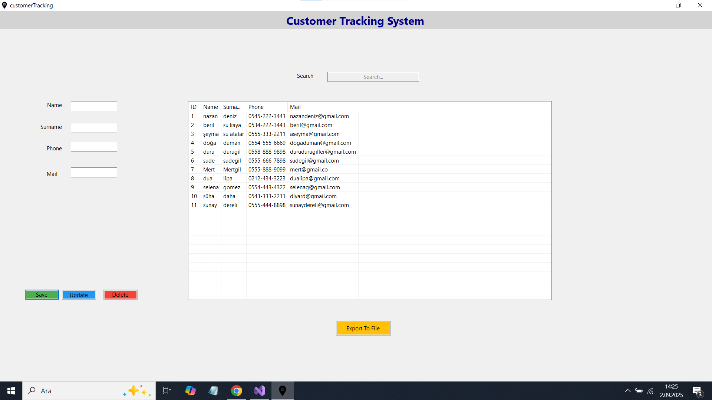

# 📌 Customer Tracking System

A Windows Forms desktop application built with C# and .NET Framework, designed to manage and track customer information efficiently.
This project demonstrates CRUD operations, data persistence, and a simple yet functional desktop UI for customer management.

# 🚀 Features

➕ Add new customers (Name, Contact Info, etc.)

✏️ Update existing customer details

❌ Delete customers

🔍 Search customers by name or ID

💾 Save and load customer data (TXT / CSV export support)

✅ Input validation to prevent errors

🖥️ Clean and user-friendly Windows Forms UI

# 📸 Screenshots

# 🛠️ Technologies Used

C# (.NET Framework)

Windows Forms

SQLite / File-based storage

Object-Oriented Programming (OOP)

# ⚙️ Installation & Setup

Clone the repository:

git clone https://github.com/nazandeniz/Customer-Tracking-System.git

Open the project in Visual Studio

Restore NuGet packages (if any)

Build and run the application

# 📂 Project Structure
Customer-Tracking-System/
│── Forms/               # Windows Forms UI
│── Entities/            # Customer entity classes
│── DataAccess/          # Data handling (file or database)
│── Program.cs           # Application entry point
│── README.md            # Project documentation

# 🎯 Future Improvements

Add login system with user roles

Export data to Excel / PDF

Improve UI with modern design / icons

Add unit tests

# 👩‍💻 Author

Nazan Deniz

- GitHub: [@nazandeniz](https://github.com/nazandeniz)
